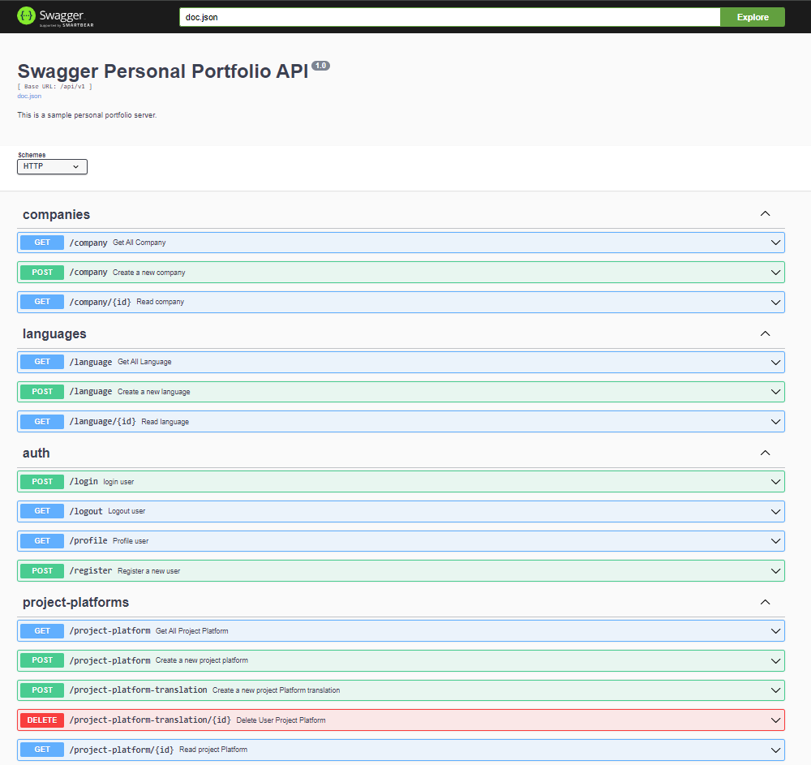
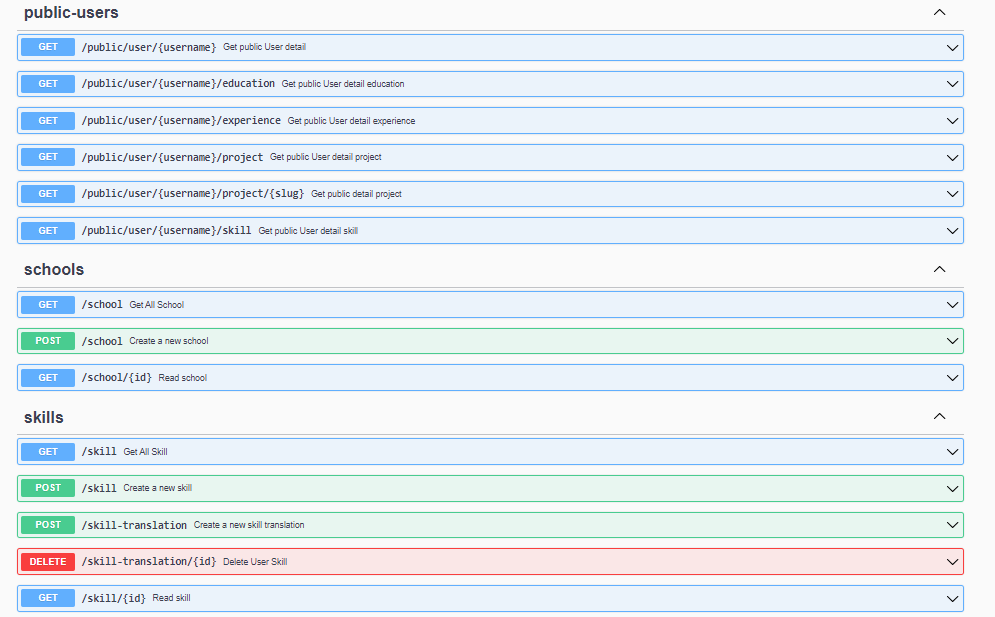
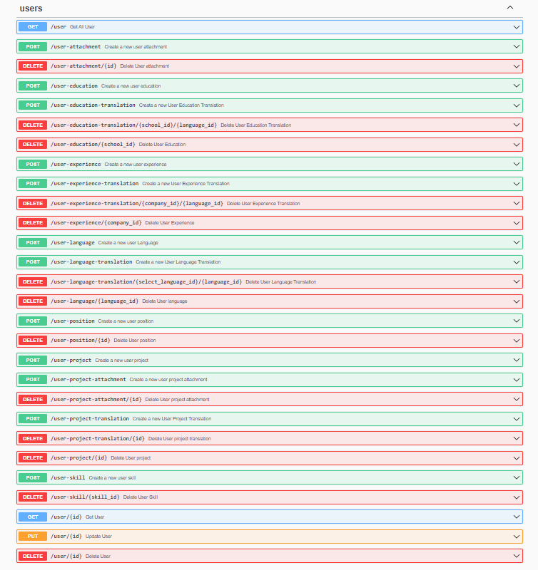

# API for Personal Portfolio

## Preview :

<br>

<br>


# Minimun Viable Product

- management company
- management school
- management skill
- management language
- management project platform
- personal management project
- personal management experience
- personal management education
- personal management language
- personal management skill
- personal management attachment
- personal management position

# Description

`config`: configuration

`docs`: swagger configuration

`handlers`: layer between operation and business logic

`repositories`: repository of specific business logic function

`models`: model configuration

`middleware`: logic of configuration on middle layer

`helper`: reusable function and tool

`assets`: external assets directory

# Dependencies:
- go1.21.6
- jwt v5
- mux v1.8.1
- gorm v1.25.7
- mysql v1.5.4
- Docker for deployment

> Be carefull with go version.

Want to contribute? Great!
## Development

Duplicate .env.example and rename to .env

Fill variable on .env that refer to database mysql

Prepare module

```sh
go mod tidy
```

Init swag

```sh
swag init
```

Running Application

```sh
go run main.go
```

Look endpoint list in Swagger Documentation

```sh
http://localhost:8080/documentation/index.html
```

### Deploy

Up docker

```sh
docker-compose up -d --build
```
